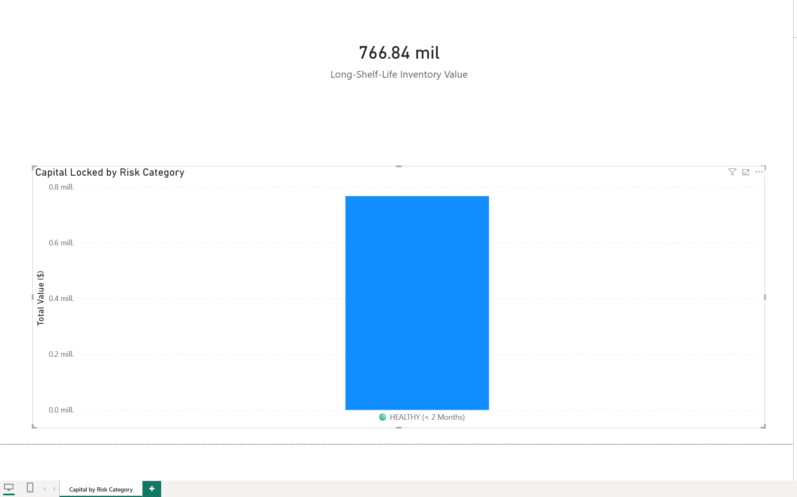

# SQL Store Inventory Validation

This project is a practical exercise to audit a warehouse database using **PostgreSQL** and **Power BI**. The goal was to identify dead stock (unsold inventory) and supply chain delays.

### 📊 Dashboard Snapshot

*(Inventory overview based on SQL analysis)*

### 💡 What I found (The Data Audit)
When running the SQL queries, the results were unexpected:
* **0** "Zombie Stock" (products with 0 sales).
* **0** Expired items.
* **0** products stored for more than 2 months.

**Conclusion:**
The dataset appears to be **synthetic or manually idealized**. Real-world warehouses always have some inefficiency or slow-moving stock.

* **Decision:** Upon detecting this "perfect" pattern, I decided to **halt further complex analysis** (like Supplier Performance metrics) as the results would be artificial. Instead, I focused this project on documenting the **validation logic** used to audit the data.

### 🛠️ What I did
Even with "perfect" data, I treated this as a real audit to practice the technical workflow:

1.  **Data Cleaning (SQL):**
    * Converted text fields to numbers (handling commas and currency symbols).
    * Fixed date formats.
    * Adjusted the timeline to simulate "Today" relative to the dataset dates.
2.  **Risk Analysis (SQL Views):**
    * Created logic to categorize products: `🟢 Healthy` vs `🔴 Toxic` (based on sales velocity).
3.  **Visualization (Power BI):**
    * Connected Power BI to the SQL output (CSV).
    * Visualized the total value of "Long-Shelf-Life" inventory.

### 📂 Files in this repo
* `01_create_tables.sql`: Database schema setup (tables and data types).
* `02_data_cleaning_and_optimization.sql`: Scripts to clean text fields and standardize formats.
* `03_inventory_views.sql`: The logic for the "Dead Stock" categorization and views.
* `Inventory_Value_by_Risk_Category.png`: The visual result from Power BI.

### 💾 Data Source
The dataset used (`inventory_data.csv`) is included in this repository for reproducibility purposes.
